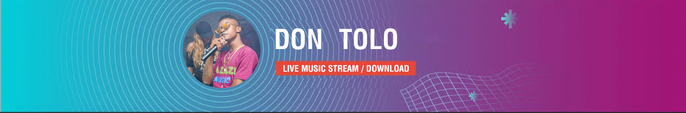

# Open Source Project


This project is a model of an online music store for an upcoming artist from Sierra Leone, named Don ToLo.


  


> ## Built With

- HTML & CSS
- FontAwesome
- SASS
- Bootstrap 4

## Live Demo

[Live Demo Link](https://ldelbel.github.io/music-store-website/)

## Getting Started

To get a local copy of the repository please run the following commands on your terminal:

```
$ cd <folder>
```

```
$ git clone https://github.com/iamdontolo/open-source
```

To install the required sass node modules

```
$ npm install -g sass

```

Run SASS on command line to automatically compile to style.css

```
$ npm run compile:sass

```
## Author

👤 **Osman Kamara**

- Github: [@ldelbel](https://github.com/iamdontolo)
- Instagram: [@iamdontolo](https://instagram.com/iamdontolo)
- Linkedin: [Osman Kamara](https://www.linkedin.com/in/osman-kamara-5b18a8247/)

## 🤝 Contributing

Contributions, issues and feature requests are welcome!

Feel free to check the [issues page](https://github.com/iamdontolo/open-source/issues).

## Show your support

Give a ⭐️ if you like this project!

## Acknowledgments

- This success of this project is inspired by my Deen of study [Director Joseph Mike Kamara](https://github.com/mykkam)
- This project is a part of my final year Bsc Degree program of study.

